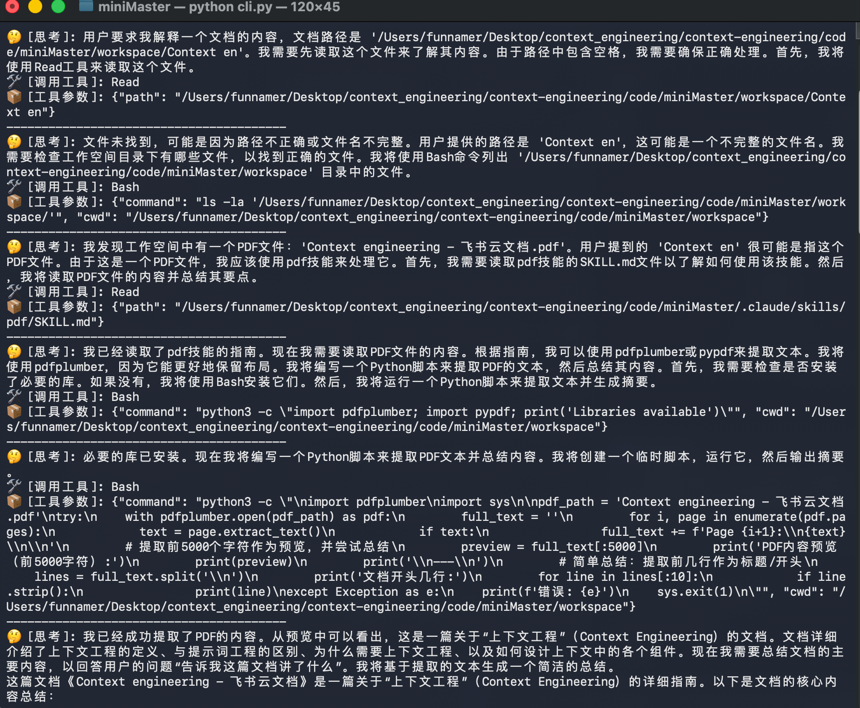

<h1 align="center"> Context Engineering - 上下文工程实战指南 </h1>

> [!WARNING]
> 🧪 Beta 公测版本提示：教程主体已完成，正在优化细节，欢迎大家提 Issue 反馈问题或建议。

## 项目简介

本项目是一本关于**上下文工程（Context Engineering）**的开源教程，旨在帮助开发者理解和掌握在大模型时代如何高效管理和组织 AI 系统的上下文信息。

随着智能体（Agent）技术的发展，传统的提示词工程（Prompt Engineering）正在向上下文工程转变。上下文工程不再仅仅是"如何写好一句话来引导 AI"，而是构建一套严密的、模块化的系统架构，通过科学地调度指令、知识、工具、记忆和状态，让 AI 系统能够在复杂、动态的环境中做出准确的响应。

本教程包含理论讲解和实践代码两部分：
- **理论部分**：系统介绍上下文工程的核心概念、设计原则和实现策略
- **实践部分**：通过 miniMaster 项目（一个最小化的 Claude Code Skills 实现），展示如何将上下文工程理论应用于实际开发

## 项目受众

本教程适合以下人群：
- **AI 应用开发者**：希望构建更复杂、更智能的 AI 应用系统
- **大模型技术爱好者**：想深入了解 Agent 系统和上下文管理机制
- **Python 开发者**：具备基础 Python 编程能力，想学习 AI 系统工程化实践

通过学习本教程，你将能够：
- 理解上下文工程与提示词工程的本质区别
- 掌握动态上下文管理的核心策略
- 学会设计可扩展的 AI 技能系统
- 动手实现一个最小化的类 Claude Code 系统

## 在线阅读

📖 [https://datawhalechina.github.io/context-engineering](https://datawhalechina.github.io/context-engineering)

## 目录
*这里写你的项目目录，及其完成状态，已完成的部分添加上跳转链接*

| 章节名                                                                                                                   | 简介                                               | 状态 |
|-----------------------------------------------------------------------------------------------------------------------|--------------------------------------------------| ---- |
| [第1章 什么是上下文工程](https://github.com/datawhalechina/repo-template/blob/main/docs/chapter1)                               | 上下文工程的定义以及与提示词工程的区别                              | ✅ |
| [第2章 为什么需要上下文工程](https://github.com/datawhalechina/repo-template/blob/main/docs/chapter2)                             | 从实际场景落地的角度分析，为什么需要上下文工程                          | ✅ |
| [第3章 如何设计上下文中的每一个组件？](https://github.com/datawhalechina/repo-template/blob/main/docs/chapter3)                        | 给出在设计agent时需要遵循的原则                               | ✅ |
| [第4章 动态上下文管理策略 (Dynamic Context Strategies)](https://github.com/datawhalechina/repo-template/blob/main/docs/chapter3) | 如何去动态管理上下文                                       | ✅ |
| [第5章 Progressive disclosure（渐进式披露)](https://github.com/datawhalechina/repo-template/blob/main/docs/chapter3)          | 一种前沿而优雅的上下文工程设计哲学                                | ✅ |
| [第6章 miniMaster-最小实现claude code skills板块](https://github.com/datawhalechina/repo-template/blob/main/docs/chapter3)    | 基于渐进式披露的设计哲学，最小化实现agent skills的核心逻辑，并可视化过程，不再是黑盒 | 🚧 |
## miniMaster
示例采用authropic官方关于文档的skills-docx，pdf，pptx，xlsx

运行示例：

完整日志：
[主程序](./code/miniMaster/log.txt)

## 贡献者名单

| 姓名  | 职责 |
|:----| :---- |
| 张文星 | 项目负责人 |

## 参与贡献

- 如果你发现了一些问题，可以提Issue进行反馈，如果提完没有人回复你可以联系[保姆团队](https://github.com/datawhalechina/DOPMC/blob/main/OP.md)的同学进行反馈跟进~
- 如果你想参与贡献本项目，可以提Pull Request，如果提完没有人回复你可以联系[保姆团队](https://github.com/datawhalechina/DOPMC/blob/main/OP.md)的同学进行反馈跟进~
- 如果你对 Datawhale 很感兴趣并想要发起一个新的项目，请按照[Datawhale开源项目指南](https://github.com/datawhalechina/DOPMC/blob/main/GUIDE.md)进行操作即可~

## 关注我们

扫描下方二维码关注公众号：Datawhale

## LICENSE

 本作品采用<a rel="license" href="http://creativecommons.org/licenses/by-nc-sa/4.0/">知识共享署名-非商业性使用-相同方式共享 4.0 国际许可协议</a>进行许可。
